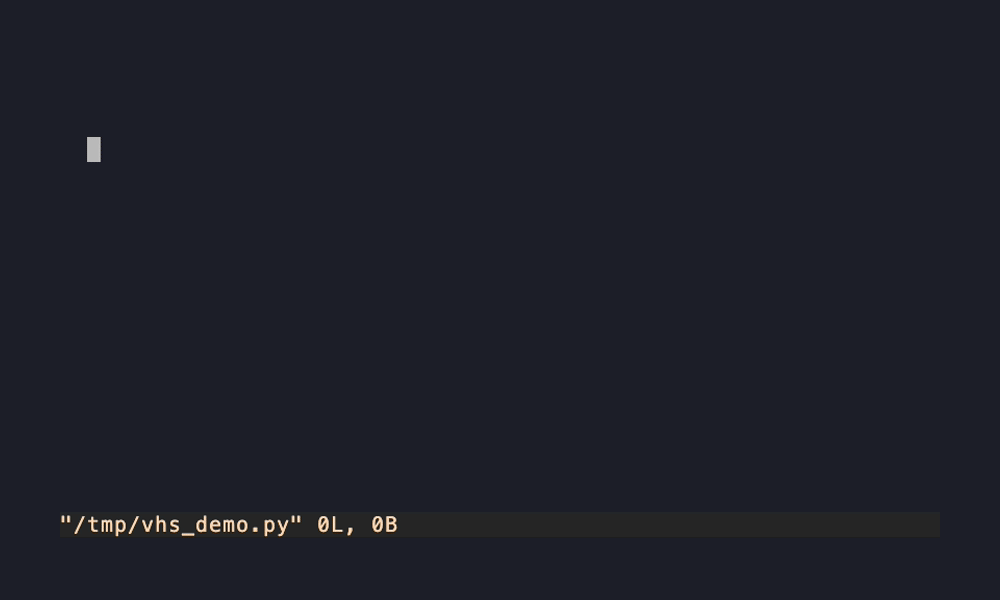

# vim-ai-autocomplete

🇺🇸 [English](README.md) · 🇧🇷 [Português](README.pt.md)

[](https://github.com/albertosca/vim-ai-autocomplete/actions/workflows/test.yml)
[](https://github.com/albertosca/vim-ai-autocomplete/actions/workflows/lint.yml)
[](LICENSE)


Autocomplete de IA via ghost-text para Vim 9+ e Neovim, com round-robin plugável de múltiplos modelos (Gemini, Claude, ou qualquer modelo que você configurar).



## Por baixo do capô

- **Duas implementações nativas em paridade de comportamento** — Vimscript puro (textprops do Vim 9) e Lua puro (extmarks do Neovim), sem camada de compatibilidade, cada uma idiomática ao seu editor.
- **365 testes, sem precisar de rede** — 166 vader (Vim) + 199 plenary (Neovim), toda chamada de API mockada, rodando a cada push no CI junto com lint (luacheck/vint).
- **Prompt FIM com detecção de redundância** — o modelo sabe o que existe depois do cursor, e qualquer coisa que ele repita (um fecha-parênteses que o auto-pairs já inseriu, um sufixo duplicado) é detectada estruturalmente, exibida riscada, e descartada ao aceitar — nunca silenciosamente.
- **Falha suave** — resposta malformada, candidate bloqueado por filtro e erro de billing viram um aviso único, nunca stack trace no meio da digitação.

## Instalação

Requer `curl` no `$PATH`. Configure pelo menos uma API key como variável de ambiente antes de abrir o Vim/Neovim (`GEMINI_API_KEY` e/ou `ANTHROPIC_API_KEY`, ou o `api_key_env` que você configurar por modelo — veja [Configuração](#configuração)).

### Pathogen (Vim)

```bash
git submodule add https://github.com/albertosca/vim-ai-autocomplete.git ~/.vim/bundle/vim-ai-autocomplete
```

### lazy.nvim (Neovim)

```lua
{
  'albertosca/vim-ai-autocomplete',
  config = function()
    require('vim-ai-autocomplete').setup()
  end,
}
```

### vim-plug

```vim
Plug 'albertosca/vim-ai-autocomplete'
```

No Neovim, chame `require('vim-ai-autocomplete').setup()` em algum ponto do seu `init.lua`, depois do plug carregar. No Vim, não precisa de nenhuma chamada extra — o `plugin/vim-ai-autocomplete.vim` já se carrega sozinho.

### mini.deps

```lua
local add = MiniDeps.add
add({
  source = 'albertosca/vim-ai-autocomplete',
})
require('vim-ai-autocomplete').setup()
```

### Pacotes nativos (`:packadd`, sem gerenciador)

```bash
# Vim
git clone https://github.com/albertosca/vim-ai-autocomplete ~/.vim/pack/plugins/start/vim-ai-autocomplete
# Neovim
git clone https://github.com/albertosca/vim-ai-autocomplete ~/.local/share/nvim/site/pack/plugins/start/vim-ai-autocomplete
```

## Configuração

Os dois lados leem as mesmas globals — globals do Vimscript ficam visíveis no Lua via `vim.g`, então existe uma única fonte de verdade mesmo no Neovim.

```vim
" Vim (~/.vimrc) ou Neovim (init.vim, ou antes do require(...).setup() no init.lua)
let g:vim_ai_autocomplete_models = [
      \ {'name': 'gemini-flash', 'family': 'gemini', 'model_id': 'gemini-3.1-flash-lite', 'api_key_env': 'GEMINI_API_KEY'},
      \ {'name': 'claude-sonnet', 'family': 'anthropic', 'model_id': 'claude-sonnet-5', 'api_key_env': 'ANTHROPIC_API_KEY'},
      \ ]
```

Ou, no Neovim, o equivalente via o facilitador `setup(opts)` (açúcar sintático sobre as mesmas globals acima — escolha um estilo ou outro, nunca os dois):

```lua
require('vim-ai-autocomplete').setup({
  models = {
    { name = 'gemini-flash', family = 'gemini', model_id = 'gemini-3.1-flash-lite', api_key_env = 'GEMINI_API_KEY' },
    { name = 'claude-sonnet', family = 'anthropic', model_id = 'claude-sonnet-5', api_key_env = 'ANTHROPIC_API_KEY' },
  },
  auto_trigger = true, -- opcional, default true
  alternatives = 3, -- opcional, default desligado; ver "Alternativas" abaixo
})
```

| Campo | Significado |
|---|---|
| `name` | O nome que você quiser dar a esse modelo em `,pr`/`,pm`/`:VimAiAutocompleteModel` |
| `family` | `'gemini'`, `'anthropic'` ou `'deepseek'` — determina o formato da requisição/resposta |
| `model_id` | O ID real do modelo enviado pra API do provedor |
| `api_key_env` | Nome da variável de ambiente que guarda a API key daquele provedor |
| `candidates_per_request` | Opcional, default 1 — quantas alternativas esse modelo devolve por requisição; leia "Alternativas" abaixo antes de subir de 1 |

Se você não configurar nada, o default é um modelo Gemini e um Claude. Um modelo só fica "ativo" (elegível pro ciclo do `,pr`) se o `api_key_env` dele estiver de fato setado e não-vazio no ambiente.

### Alternativas (ciclar entre várias sugestões)

Desligado por padrão — cada alternativa é uma chamada paga à API. Ligue informando quantas sugestões quer por trigger:

```vim
let g:vim_ai_autocomplete_alternatives = 3   " ou setup({ alternatives = 3 }) no Neovim
```

Com uma sugestão visível, `<M-.>` (Alt+.) mostra a próxima alternativa e `<M-,>` a anterior, dando a volta nas duas pontas; `Tab` aceita a que estiver na tela. As teclas só são reivindicadas com a feature ligada, e são configuráveis:

```vim
let g:vim_ai_autocomplete_cycle_next = '<C-Right>'   " ou setup({ cycle_next = ..., cycle_prev = ... })
let g:vim_ai_autocomplete_cycle_prev = '<C-Left>'
```

> **macOS:** Alt é a tecla Option, e por padrão o terminal usa ela pra digitar símbolos (Option+. digita `≥`) em vez de mandar Alt. No iTerm2, ative *Preferences › Profiles › Keys › Left Option key → Esc+* (vale pra janelas novas), ou escolha teclas sem Alt como acima. Neovim dentro do terminal tem a mesma restrição — é o terminal, não o editor. Cada alternativa passa pelo mesmo pós-processamento de uma sugestão única (redundância de parênteses, sobreposição de indentação, remoção de fences), então se comportam igual ao aceitar.

**O custo — medido, não presumido:**

Por padrão cada alternativa é **uma requisição extra**, buscada sob demanda: o primeiro trigger traz uma sugestão, e cada `<M-.>` além do fim pede mais uma — até N, e só pelo que você de fato olha. Alternativas idênticas colapsam numa só; se uma busca só repetir a resposta anterior do modelo, nada é adicionado e uma mensagem curta avisa.

O Gemini (`candidateCount`) e APIs compatíveis com OpenAI como a do DeepSeek (`n`) têm um campo pra devolver vários candidatos na **mesma** requisição, o que deixaria as alternativas quase de graça — por isso o plugin suporta isso como **opt-in por modelo**:

```vim
let g:vim_ai_autocomplete_models = [
      \ {'name': 'gemini-flash', 'family': 'gemini', 'model_id': '...', 'api_key_env': 'GEMINI_API_KEY', 'candidates_per_request': 3},
      \ ]
```

Só ligue depois de conferir que o seu modelo aceita: em chamadas reais em 01/09/2026, o `gemini-3.1-flash-lite` respondeu *"Multiple candidates is not enabled for this model"* e o `deepseek-v4-pro` *"Invalid n value (currently only n = 1 is supported)"* — e um modelo que rejeita o campo devolve **sugestão nenhuma**, que é o motivo de o padrão ser sob demanda. A Messages API da Anthropic não tem esse campo, então lá é sempre sob demanda.

## Uso

| Tecla | Ação |
|---|---|
| `Tab` | Aceita a sugestão visível (cai pro seu mapping original de `Tab` caso contrário) |
| `<C-]>` | Descarta a sugestão visível sem sair do insert mode |
| `<M-.>` / `<M-,>` | Próxima / anterior alternativa — só com `g:vim_ai_autocomplete_alternatives >= 2` (ver Configuração) |
| *(menu aberto)* | Enquanto um menu de completion está na tela (popup do CoC no Vim, blink.cmp / nvim-cmp no Neovim) nada é pedido nem renderizado — o menu vence, mesmo que uma resposta chegue com ele aberto |
| `…` no fim da linha | Há uma requisição em voo (aparece só depois de 400 ms — `g:vim_ai_autocomplete_pending_delay_ms` — então respostas rápidas nunca piscam; some no instante em que chega a resposta, um resultado velho ou uma falha) |
| `,pt` | Liga/desliga o auto-trigger |
| `,pr` | Cicla pro próximo modelo ativo (só registrado com 2+ modelos ativos) |
| `,pm` | Escolhe um modelo num menu flutuante (`j`/`k` move, `<CR>` seleciona, `<Esc>`/`q` fecha) — só registrado com 2+ modelos ativos |
| `:VimAiAutocompleteModel <nome>` | Troca direto pra um modelo pelo nome, com completion |

## Arquitetura

- **Prompting FIM (fill-in-the-middle)**: o buffer ao redor do cursor é dividido numa seção "antes" e "depois" (nunca enviando a linha atual inteira pra nenhum dos dois lados), pra o modelo saber exatamente onde o cursor está e o que já existe depois dele.
- **Detecção de redundância**: dois mecanismos, somados numa única contagem de "caracteres a descartar" do texto real do buffer depois do cursor — uma comparação estrutural de pilha de parênteses/aspas (pega o caso em que a sugestão fecha algo que já estava aberto antes do cursor) e uma checagem textual de overlap de sufixo/prefixo (pega o caso em que o modelo literalmente repete o que já está ali). O trecho descartado é sempre mostrado em vermelho/riscado antes de ser removido no accept, nunca cortado silenciosamente.
- **Renderização do ghost text**: no Vim usa `prop_add`/textprop (Vim 9+); no Neovim usa extmarks (`nvim_buf_set_extmark` com `virt_text`/`virt_lines`).
- **Amigável a prompt caching por construção**: o contexto "antes" é ancorado (não é janela deslizante), então o prefixo do prompt se repete byte a byte entre teclas — Gemini e DeepSeek cacheiam implicitamente, e o request da Anthropic marca o bloco estável com `cache_control` (medido ao vivo: 2.876 de 2.895 tokens de input lidos do cache a 0,1× digitando dentro de uma linha).
- **Contexto sensível a escopo nos dois lados**: o contexto "antes" é cortado na definição que envolve o cursor, então o modelo vê a função sendo escrita em vez do arquivo inteiro. O Neovim tenta o Treesitter primeiro e cai numa heurística de indentação e palavra-chave, o que importa mais do que parece: o Treesitter não devolve nada enquanto a linha do cursor está incompleta — o único estado em que esse plugin roda — então, antes do fallback, o corte silenciosamente nunca acontecia durante a digitação. O Vim usa só a heurística. Medido com chamadas reais num arquivo cheio de stubs inacabados: 4/6 completions caíram na função errada com o arquivo inteiro como contexto, 0/6 com o corte.
- **Os vizinhos voltam como RELATED DEFINITIONS**: cortar no escopo também esconde o resto do arquivo, e isso custa precisão de verdade — completar uma chamada a um helper definido antes caiu de 6/6 certo para 0/6, com o modelo reinventando o helper inline. Cada definição vizinha volta como assinatura mais algumas linhas de corpo (via LSP no Neovim, direto do buffer caso contrário), o que devolveu 6/6 mantendo o erro de alvo em 0/6.
- **Enriquecimento de contexto (só Neovim)**: o corte do buffer é sensível ao escopo do Treesitter (usa a função/classe que envolve o cursor em vez de uma contagem ingênua de linhas) quando há um parser disponível, caindo pro corte ingênuo caso contrário; uma consulta LSP `textDocument/definition` com timeout curto (150ms) opcionalmente acrescenta definições reais entre arquivos para símbolos em escopo.

## Contribuindo

```bash
bash test/run.sh
```

Roda a suite completa (vader pro lado Vim, plenary pro lado Neovim) — veja o [CI](.github/workflows/test.yml) pra ver como isso roda no GitHub Actions. Não precisa de API key nem acesso à rede; todo teste ou é lógica pura ou mocka a chamada de API.

## Créditos

- [minuet-ai.nvim](https://github.com/milanglacier/minuet-ai.nvim) inspirou uma decisão de design específica — a ponderação 75/25 do `context_ratio` no prompt FIM (mais peso pro texto antes do cursor). Nenhum código foi copiado.
- [copilot.vim](https://github.com/github/copilot.vim) inspirou a *técnica* do ghost text (as APIs `prop_add`/textprop do Vim 9, com debounce via `timer_start`) — não o código dele. `copilot.vim` é "All Rights Reserved", não é open-source, então só as APIs do Vim publicamente documentadas foram reaproveitadas, implementadas de forma independente.

## Licença

MIT — veja [LICENSE](LICENSE).

## Autor

[Alberto de Sá Cavalcanti de Albuquerque](https://github.com/albertosca) — [LinkedIn](https://www.linkedin.com/in/albertosca/)
